# Bug Bounty Framework (BBF)

> 🛡️ **A 100% browser-based bug bounty & pentesting workbench built with React.** No Kali Linux. No Burp Suite. No installs. Just open in any browser and hunt.

[](#)
[](#)
[](#)
[](#)

A free, open-source alternative to Burp Suite Community, Caido, and pieces of Kali Linux — all running natively in your browser. Built for bug bounty hunters, CTF players, red teamers, and security students who don't want to install a virtual machine to start hunting.

---

## 📸 Screenshots

### Dashboard & Automated Workflow
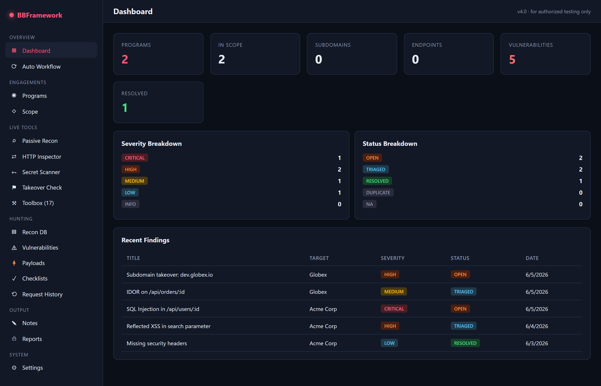
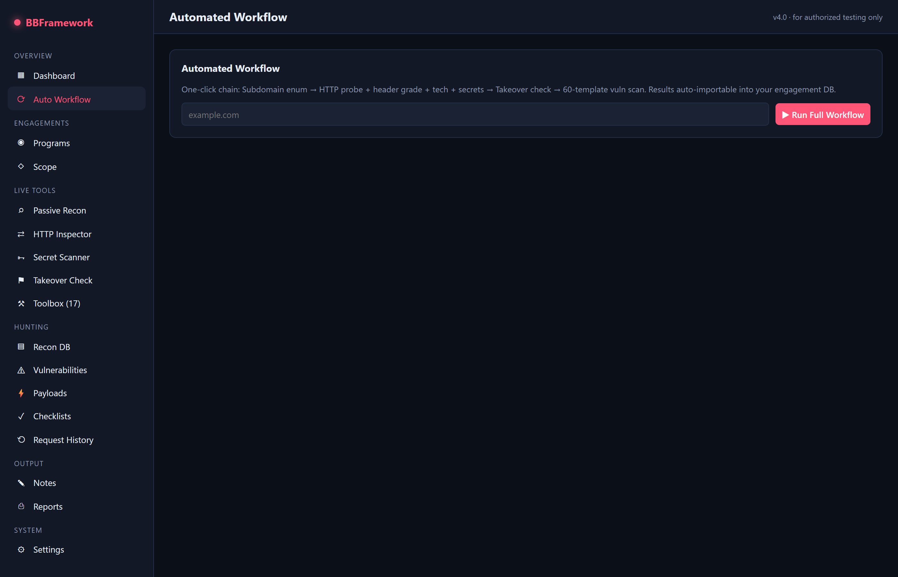

### Live Recon Tools
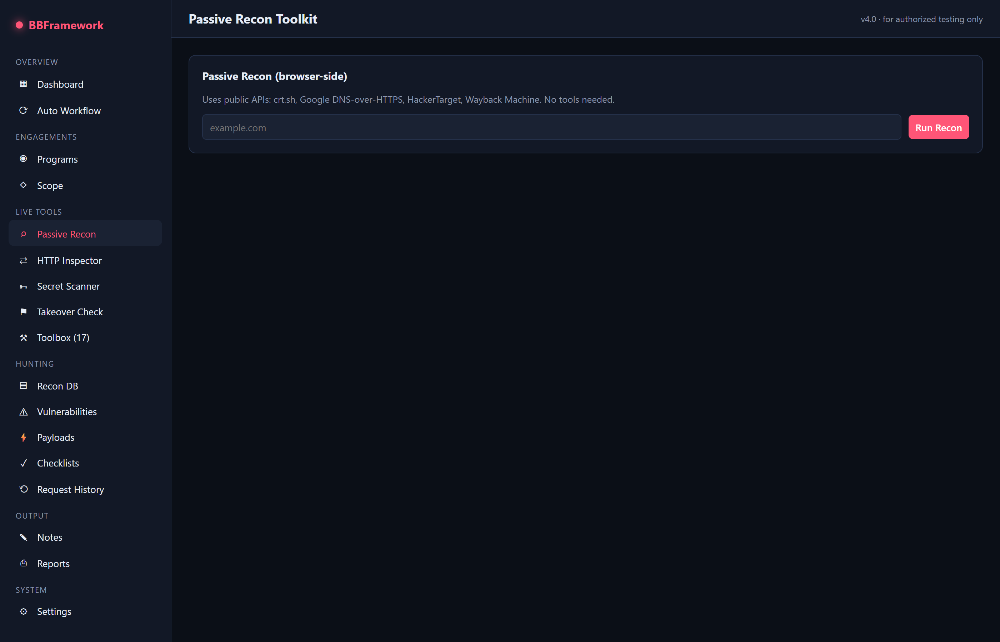
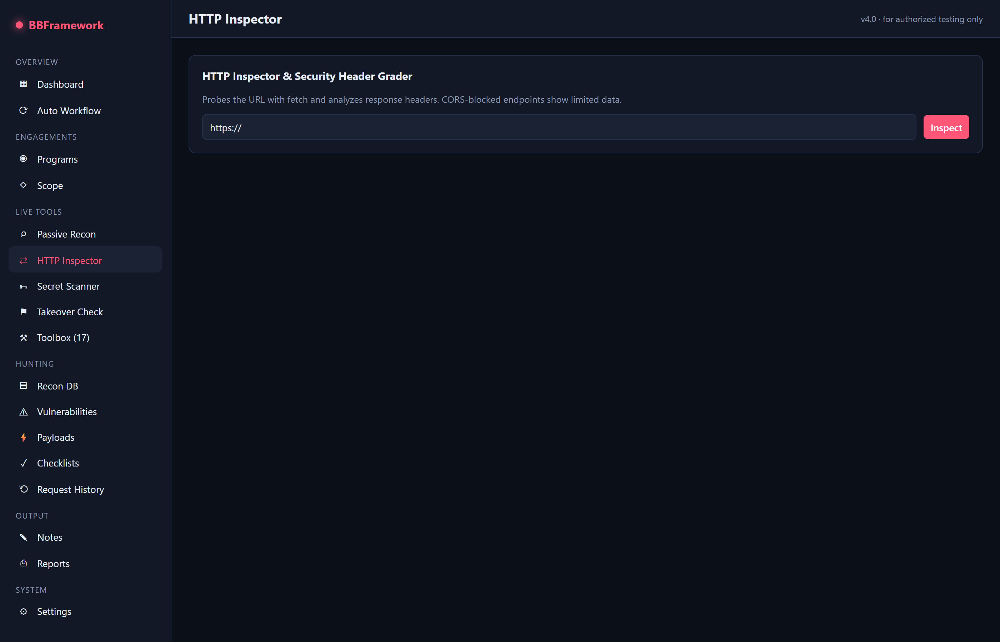
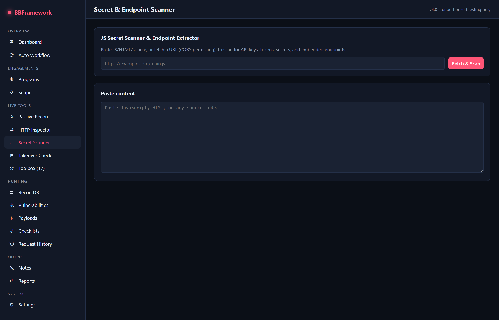

### Toolbox (17 in-browser tools)
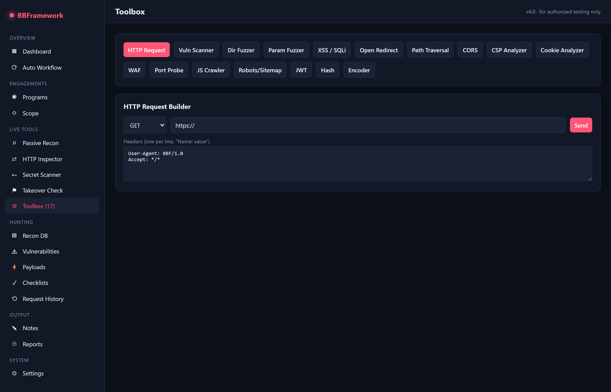
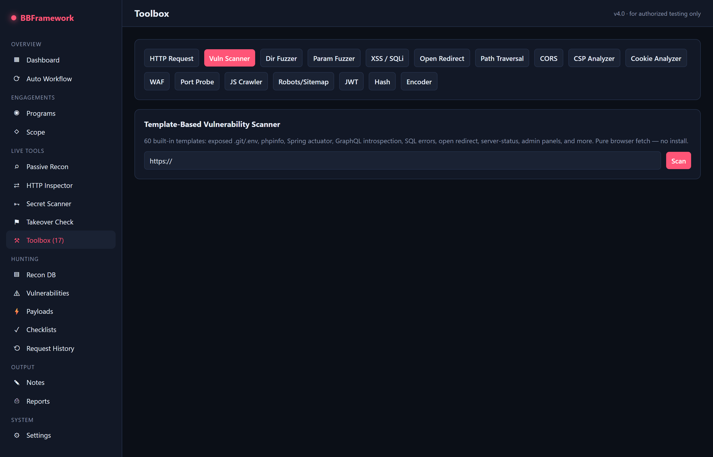
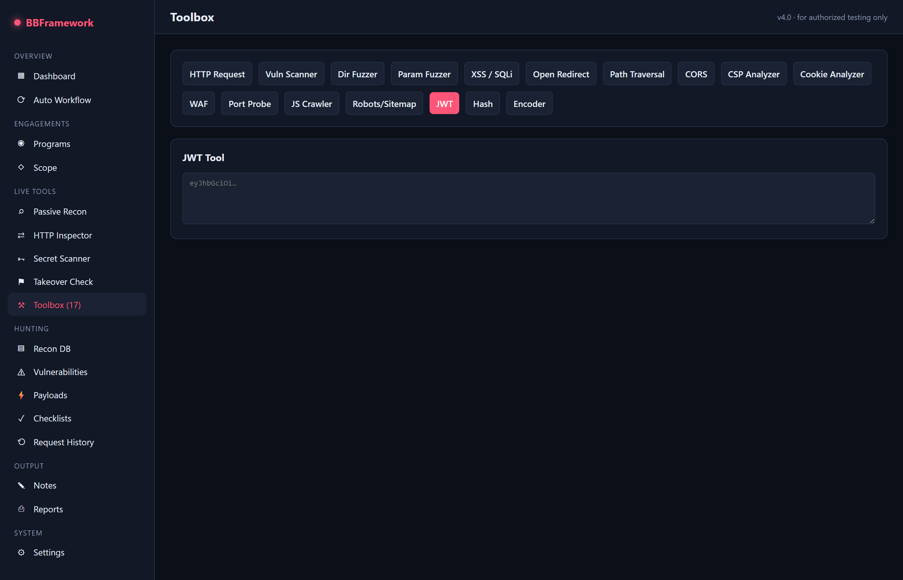
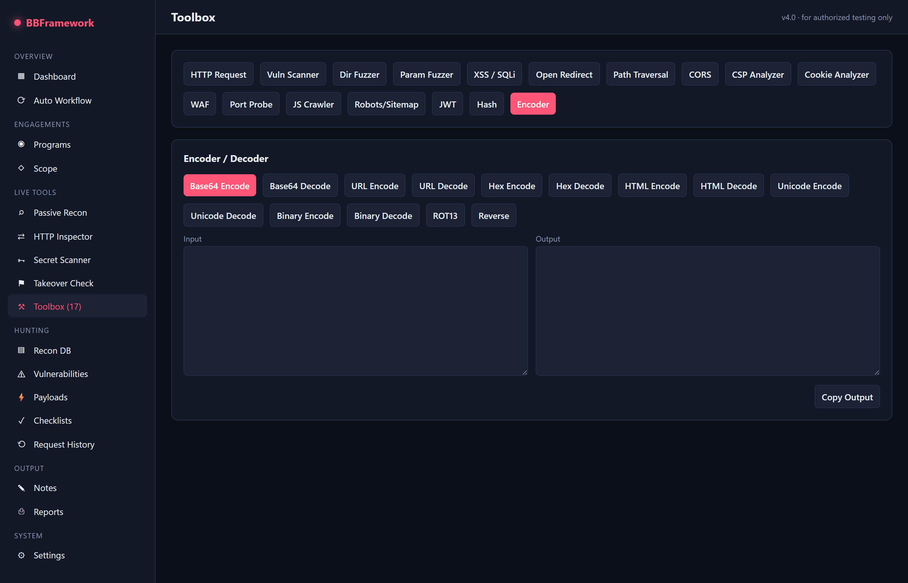

### Engagement Tracking
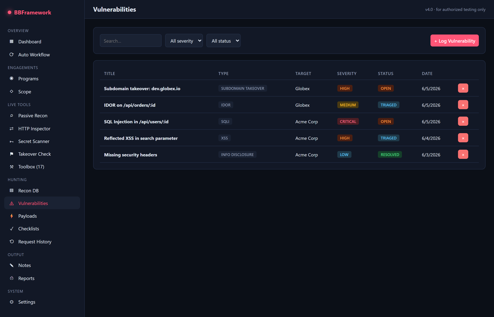
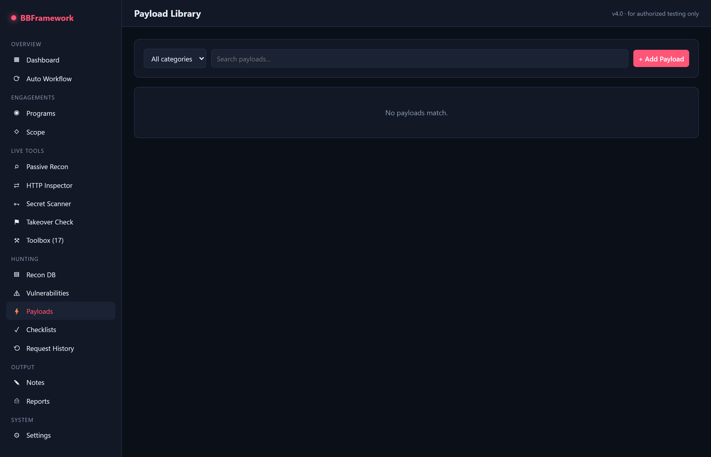
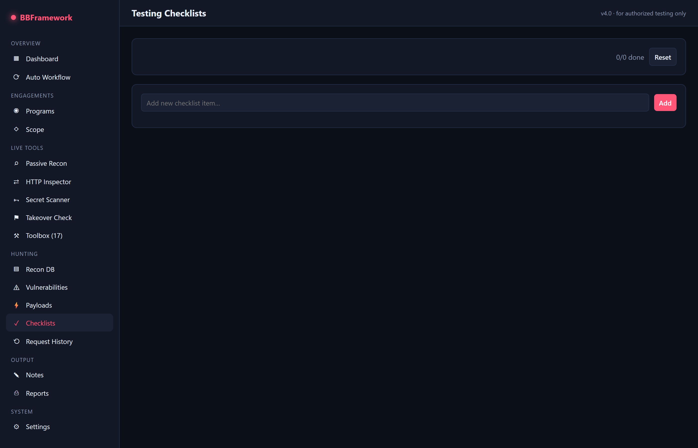

---

## 🔑 Keywords

`bug bounty` · `bugbounty framework` · `pentesting toolkit` · `penetration testing` · `web security` · `ethical hacking` · `cybersecurity tools` · `kali linux alternative` · `burp suite alternative` · `caido alternative` · `web vulnerability scanner` · `nuclei alternative` · `subdomain enumeration` · `subdomain takeover` · `XSS scanner` · `SQL injection scanner` · `SSRF tester` · `LFI scanner` · `path traversal` · `open redirect` · `JWT cracker` · `JWT decoder` · `hash cracker` · `secret scanner` · `JS endpoint extractor` · `directory bruteforce` · `parameter discovery` · `WAF detector` · `CORS misconfiguration` · `CSP analyzer` · `cookie analyzer` · `recon tool` · `OSINT` · `crt.sh subdomain enum` · `wayback machine` · `payload library` · `XSS payloads` · `SQLi payloads` · `CTF tools` · `red team` · `blue team` · `infosec` · `hacker tools` · `online security scanner` · `browser pentesting` · `no-install hacking tools` · `react security app` · `HackerOne` · `Bugcrowd` · `Intigriti` · `Synack`

---

## ✨ Why this exists

Most bug bounty tooling assumes you've installed Kali, Go, Python, dozens of CLI tools, plus a proxy. That's a barrier for:

- 🎓 **Students** learning web security
- 🌍 **Researchers** on locked-down corporate laptops
- 🏃 **Hunters** who want to triage a target in 30 seconds, not 30 minutes
- 🏁 **CTF players** during competitions

BBF gives you a real, useful subset of the bug bounty stack — **with zero installation beyond Node for the dev server**.

---

## 🚀 Quick Start

```bash
git clone https://github.com/mustafa-abdalrazaq/bugbounty-framework
cd bugbounty-framework
npm install
npm run dev
```

Open http://localhost:5173 — done.

---

## 🛠️ Features (everything runs in the browser)

### Automated Workflow
- **One-click engagement** — subdomain enum → header grade → tech fingerprint → secret scan → takeover check → 50+ vuln templates → auto-import findings

### Live Recon (4 modules)
- **Passive Recon** — crt.sh + HackerTarget subdomain enum, DNS-over-HTTPS, Wayback Machine URLs
- **HTTP Inspector** — security-header grader (A–F), tech-stack fingerprinting
- **Secret Scanner** — 16 regex patterns for AWS keys, GitHub tokens, Slack, Google, Stripe, JWT, private keys
- **Subdomain Takeover Checker** — CNAME resolution + fingerprint match against 11 services

### Toolbox (17 in-browser tools)
| Tool | What it does |
|---|---|
| **HTTP Request Builder** | Burp Repeater-style request crafting |
| **Vuln Scanner** | 50+ templates: exposed .git/.env, Spring Actuator, GraphQL introspection, SQL errors, server-status… |
| **Directory Fuzzer** | 300+ path wordlist, concurrent fetch |
| **Parameter Fuzzer** | 200+ param names via response-diff |
| **XSS / SQLi Tester** | Reflection, SQL error, time-based blind detection |
| **Open Redirect Tester** | 15 params × 14 payloads = 210 combos |
| **Path Traversal / LFI** | /etc/passwd, win.ini, PHP source, /proc disclosure |
| **CORS Misconfig Tester** | Origin reflection, wildcard+credentials, null-origin |
| **CSP Analyzer** | Parses & grades CSP headers, flags unsafe-inline/wildcards |
| **Cookie Analyzer** | Secure/HttpOnly/SameSite flags, embedded JWT detection |
| **WAF Detector** | 28 WAF/CDN fingerprints (Cloudflare, Akamai, Imperva, F5…) |
| **Port Probe** | 27 common web ports via fetch timing |
| **JS Crawler** | Recursive `<script src>` fetch + secret/endpoint extraction |
| **Robots/Sitemap Parser** | Auto-import discovered URLs |
| **JWT Tool** | Decode, "alg:none" attack, HS256 dictionary cracker |
| **Hash Tool** | MD5/SHA-1/256/384/512 generator + identifier + cracker |
| **Encoder/Decoder** | Base64, URL, hex, HTML, Unicode, binary, ROT13 |

### Engagement Tracking
- **Programs** — HackerOne/Bugcrowd/Intigriti/Synack/YesWeHack target manager
- **Scope** — in-scope/out asset list with types (domain, wildcard, IP, API…)
- **Vulnerabilities** — full CRUD tracker with severity, status, PoC, filters
- **Payloads** — 16-category library: XSS, SQLi, SSRF, LFI, XXE, SSTI, NoSQLi, command injection
- **Checklists** — Recon, Web, API testing methodology
- **Notes** — multi-note workspace
- **Request History** — every fetch logged for review
- **Reports** — Markdown per-finding + full styled HTML engagement report (print-to-PDF ready)

---

## 🏗️ Architecture

- **React 18 + Vite + React Router** — fast dev experience, instant HMR
- **Zero runtime backend** — everything client-side
- **Web Crypto API** for SHA hashes + HMAC
- **Pure-JS MD5** for cracking legacy hashes
- **localStorage** persistence with JSON export/import
- **Concurrent fetch worker pool** for fast fuzzing

---

## ⚠️ Browser Limits (honest reality check)

Browsers sandbox JavaScript for safety. This means:
- **CORS** blocks reading responses from ~80% of real targets (you'll see `cors` in results)
- **No raw sockets** — port scanning is HTTP-only, no nmap-style probing
- **No request interception** — can't MITM your own traffic (need a real proxy for that)

For everything within those limits, the framework is fully functional and genuinely useful.

---

## 🎯 Use Cases

- **Bug bounty triage** — quickly check a new target's headers, .git, .env, takeovers
- **CTF web challenges** — instant payload library, JWT cracker, encoders
- **Security training** — explore vulnerabilities without setting up Kali
- **Pre-engagement recon** — subdomain enum, sitemap parsing, tech fingerprinting
- **Pentest reporting** — track findings, generate Markdown/HTML/PDF reports

---

## ⚖️ Legal

**Authorized testing only.** Use BBF only against:
- Your own assets
- Bug bounty programs you're enrolled in
- CTF challenges
- Lab environments you own

Unauthorized testing is illegal in most jurisdictions. The authors accept no liability for misuse.

---

## 🤝 Contributing

PRs welcome! Especially:
- Additional vulnerability templates
- More WAF fingerprints
- Wordlist expansion
- New tool modules

---

## 📜 License

MIT — do what you want, just don't blame us.

---

**⭐ Star this repo if it saves you time on your next hunt.**
